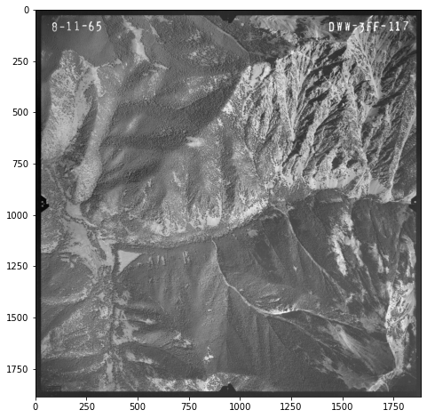
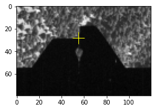
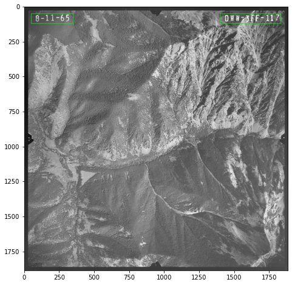
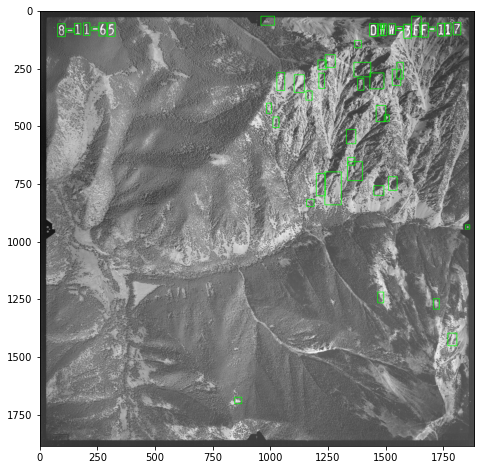
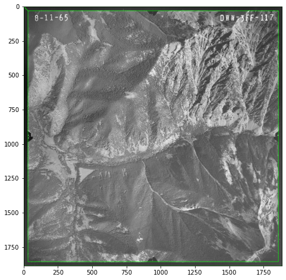
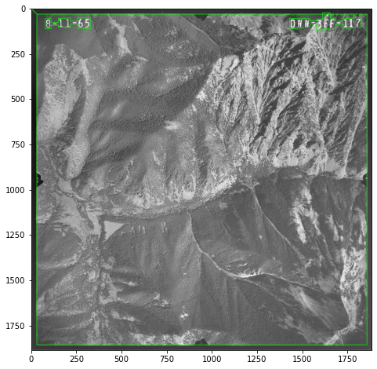
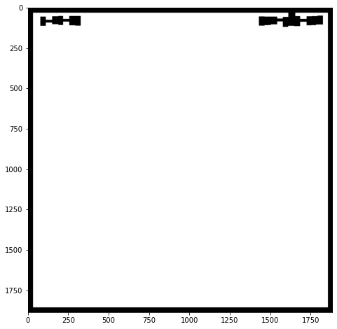

# aerio
---

Automated processing of historical aerial imagery. Quickly crop images, match histograms, detect fiducials, and mask labels and borders.

# Example


```python
import cv2
import matplotlib.pyplot as plt
import numpy as np
import os

from aerio.Photo import Photo
from aerio.PhotoCollection import PhotoCollection
from aerio.BoundingBoxCollection import BoundingBoxCollection
from aerio import utils
```

## Loading photos
Before processing, photos must be loaded into a Photo Collection


```python
# Select a directory that contains multiple photos
photo_dir = os.path.join("data")
# Generate absolute paths to each photo
photo_paths = utils.list_paths(photo_dir, valid_extensions=[".tif"])
# Load all photos in the directory as a Photo Collection
collection = PhotoCollection(photo_paths, photo_size=(224, 224))
```

### Previewing and describing photos


```python
# Indexes can be used to select single photos from within a collection
photo = collection[0]

# Printing a photo displays various parameters
print(photo)

# Previewing a photo displays a thumbnail for visual reference
photo.preview(size=(8, 8))
```

    DWW_3FF_117
    Resolution (px): 1886 (H) x 1885 (W)
    DPI: 213.8022
    Size (mm): 224 (H) x 224 (W)
    Pixel size (mm): 0.1188 (H) x 0.1188 (W)
    
    


    

    


### Pre-processing a photo collection
Pre-processing can be used to make sure all photos within a collection are equal size and similar lighting, which can improve aerial photo triangulation accuracy.


```python
# Crop all photos to the minimum photo dimensions
collection.crop()

# Match histograms for all photos using one of the photos as a reference
collection.match_histograms()
```

## Locating fiducials
Fiducial markers may need to be located to perform internal alignment between photos. `aerio` supports automatic location of notched fiducials, as shown in this example.


```python
# Automatically locate the fiducial point in each photo. The size argument indicates the approximate height and width of the fiducial. If fiducials cannot be accurately located, try adjusting the size to include less or more of the fiducial.
collection.locate_fiducials(size=(80, 120))

# Individual fiducials can be previewed to confirm location accuracy
collection[0].fiducials.bottom.preview()
```


    

    


```python
# Coordinates can also be printed and input into other software
collection[0].fiducials.coordinates
```


    [(939.0, 54.0), (1832.0, 946.0), (938.0, 1833.0), (53.0, 945.0)]


## Masking
Historical aerial photos often contain elements such as borders and labels that are not part of the image and may interfere with aerial triangulation. `aerio` contains tools to mask these objects.

### Labels
`aerio` uses bounding boxes to generate masks. To mask labels, their bounding boxes must first be located. This can be done manually by entering coordinates or automatically using text-detection libraries.

#### Manually locating labels
Bounding boxes can be manually created as a list of pixel coordinates. Coordinates can be entered clockwise or counterclockwise. If labels are at the same position in every image, manually locating labels may be worth the hassle.


```python
# Boxes can be manually created as a list of pixel coordinates. Coordinates can be entered clockwise or counterclockwise.
upper_left = [[50, 50], [350, 50], [350, 120], [50, 120]]
upper_right = [[1400, 50], [1830, 50], [1830, 120], [1400, 120]]

labels = BoundingBoxCollection([upper_left, upper_right], photo)

labels.preview()
```


    

    


#### Automatically locating labels
There are many techniques for automatically locating text within images. In this example, we will use the `swtloc` library to generate bounding boxes around text. This method can handle labels that are in different positions within different images, but is prone to locating false positive labels and typically requires parameter tuning and post-processing to achieve good results.


```python
from swtloc import SWTLocalizer

swtl = SWTLocalizer()

swtl.swttransform(image=photo.img, save_results=False,
                  edge_func = 'ac', ac_sigma = 0.4, text_mode = 'db_lf',
                  gs_blurr=True, blurr_kernel = (15, 15), 
                  minrsw = 5, maxrsw = 15,
                  minCC_comppx = 50, maxCC_comppx = 1000,  
                  max_angledev = np.pi/6,
                  acceptCC_aspectratio = 5.)

bbox, _ = swtl.get_extreme_bbox(show=False)

# Turn the lists of coordinates into Bounding Box objects
labels = BoundingBoxCollection(bbox, photo)
# Preview the un-processed bounding boxes. Note the large number of false positive boxes.
labels.preview(color=(0, 255, 0))
```

    Transforming...
    Operation Completed!
    


    

    


##### Post-processing bounding boxes
`aerio` includes post-processing tools to clean up bounding boxes.


```python
# Collapse nearby bounding boxes to merge characters. An asymetrical kernel helps to connect horizontally adjacent characters.
labels.collapse(kernel=np.ones((5, 15), np.uint8), iterations=20)

# Filter for boxes near the edge of the image that are wider than tall.
labels.filter(max_edge_distance = 100, max_hw_ratio=0.5)

labels.preview(color=(0, 255, 0))
```


    

    


### Photo borders
Aerial photo margins often contain borders that can interfere with aerial triangulation. `aerio` can automatically generate bounding boxes around photo borders. This will only work if the borders are relatively straight and centered.


```python
border = photo.border_box(30)

borders = BoundingBoxCollection([border], photo)
borders.preview()
```


    

    


### Combining bounding boxes
Additional boxes can be added to a BoundingBoxCollection by adding a list of coordinates or adding the boxes from another collection. This can be used, for example, to combine label boxes and border boxes into a single collection that can be masked.


```python
combined = borders + labels

combined.preview()
```


    

    


### Generating masks from boxes


```python
# Generate an array that can be exported as an image to mask the labels and borders.
mask = combined.generate_mask()

_, ax = plt.subplots(figsize=(8, 8))
ax.imshow(mask, cmap="gray")
```


    <matplotlib.image.AxesImage at 0x1b03a8647f0>


    

    

